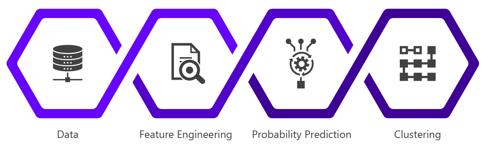

[![LinkedIn][linkedin-shield]](https://www.linkedin.com/in/advaithasabnis/)
[![Website][website-shield]](https://advait.herokuapp.com/)

 

  
  <h3 align="center">Target and Market</h3>

  

    A Propensity Modelling Project
     
    by Advait Hasabnis
     
    <a href="https://advait.herokuapp.com/" target="_blank"><strong>Explore the dashboard »</strong></a>

<!-- TABLE OF CONTENTS -->
## Table of Contents

* [About the Project](#about-the-project)
* [Data](#data)
* [Approach](#approach)
* [Built With](#built-with)
* [Contact](#contact)

<!-- CONTENTS -->
## About The Project
This project is in collaboration with a company that develops a popular cryptocurrency portfolio tracking application for Android and iOS. As of May 2020, it has hundreds of thousands of monthly active users. The app has a freemium model and users have the option to purchase its paid premium service. The app does not store any personal information about its users such as their email addresses or phone numbers. As a result, targeted marketing efforts are impeded by the lack of personal or demographic information.

<b>Target and Market</b> uses anonymized user behaviour and in-app data to identify the best candidates (that are most likely to convert) for a marketing campaign. The tool further segments the selected targets to enable the company to maximize their return on marketing investment by tailoring their campaign to each segment.

<!-- DATA -->
## Data
Data for this project is private. Every user's events in the app are logged via Google Analytics for Firebase and stored on Google BigQuery. This project uses events from <b>May 2020</b> with over 150 million logged events. For every logged event, a timestamp, session id and engagement time are available. Additionally, data such as the number of transactions and value of investment portfolio are queried from MySQL.

At the request of the company, numbers have been scaled using a secret multiplier to obfuscate real values.

<!-- APPROACH -->
## Approach

    

### Data
I queried behaviour data from BigQuery (1 table for each day of May) and investment portfolio data from MySQL (multiple tables containing user information, transaction information, asset price information).</li>

### Feature Engineering
I created the features using the 150 million events logged via Google Analytics. Some of the important ones include:
* Engagement (average session time)
* Frequency (active days in May) and
* Recency (last session).

Additional features from the investment data were created. Two key features include:
* Value of investments
* Number of transactions

### Probability Prediction
I used a classification model (XGBoost) to estimate a probability for each user that they are a paid user. Free users that have a high estimated probability are expected to convert at a better rate than those with lower probabilities. 

### Dashboard
<b>Input</b>: The company inputs the number of users (N) they want to target for a particular marketing campaign.
 
<b>Background Process</b>: The top N users (by estimated probability) are selected and their characteristics displayed. A clustering algorithm (Mini Batch K-Means) segments the N selected users based on three key features.
 
<b>Output</b>: The dashboard displays characteristics such as average session time, average value of investments, and average days of activity in May of the selected N users. Secondly, the dashboard also displays characteristics of each identified cluster and their unique qualities.

<!-- TOOLS AND FRAMEWORKS -->
## Built With
* [BigQuery](https://cloud.google.com/bigquery/)
* [MySQL](https://www.mysql.com/)
* [Pandas](https://pandas.pydata.org/)
* [Scikit-Learn](https://scikit-learn.org/stable/index.html)
* [XGBoost](https://xgboost.ai/)
* [Plotly Dash](https://plotly.com/dash/)
* [Heroku](https://www.heroku.com/)

<!-- CONTACT -->
## Author

<b>Advait Hasabnis</b>

Project Link: [https://github.com/advaithasabnis/target-and-market](https://github.com/advaithasabnis/target-and-market)
 
Dashboard Link: [https://advait.herokuapp.com/](https://advait.herokuapp.com/)

<!-- MARKDOWN LINKS & IMAGES -->
[linkedin-shield]: https://img.shields.io/badge/-LinkedIn-black.svg?style=flat&logo=linkedin&colorB=2867B2
[website-shield]: https://img.shields.io/badge/-Website-blueviolet?style=flat
