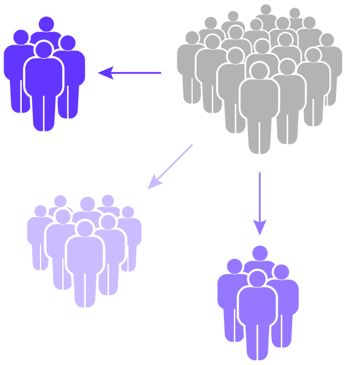

[![LinkedIn][linkedin-shield]](https://www.linkedin.com/in/advaithasabnis/)

 

  <h3 align="center">Target and Market</h3>

  

    A Customer Segmentation Project
     
    by Advait Hasabnis
     
    <a href="https://github.com/advaithasabnis/"><strong>Explore the docs »</strong></a>

<!-- TABLE OF CONTENTS -->
## Table of Contents

* [About the Project](#about-the-project)
* [Data](#data)
* [Approach](#approach)
* [Built With](#built-with)
* [Contact](#contact)

<!-- CONTENTS -->
## About The Project

This project is in collaboration with a company that develops a popular cryptocurrency portfolio tracking application for Android and iOS. As of May 2020, it has hundreds of thousands of monthly active users. The app has a freemium model and users have the option to purchase its paid premium service. The app does not store any personal information about its users such as their email addresses or phone numbers. As a result, targeted marketing efforts are impeded by the lack of demographic information.

<b>Target and Market</b> uses anonymized user behaviour data for the app to help the company better understand their users and tailor their marketing efforts to monetize more users.

<!-- DATA -->
## Data

Data for this project is private. Every user's events in the app are logged via Google Analytics for Firebase and stored on Google BigQuery. This project uses events from May 2020 with over 150 million logged events. For every logged event, a timestamp, session id and engagement time are available.

At the request of the company, numbers have been scaled using a multiplier to obfuscate real numbers. 

## Approach

	

<ul>
<li>Query required data from BigQuery</li>
<li>Engineer features: average session time, date of first install, recency (last session)</li>
<li>Cluster users</li>
<li>Validate clusters by visualization and lift in terms of ratio of paid users</li>
</ul>
## Built With
* [BigQuery](https://cloud.google.com/bigquery/)
* [Pandas](https://pandas.pydata.org/)
* [Scikit-Learn](https://scikit-learn.org/stable/index.html)
* [Plotly](https://plotly.com/)

<!-- CONTACT -->
## Contact

Advait Hasabnis - advait.iitb@gmail.com

Project Link: [https://github.com/advaithasabnis/insight](https://github.com/advaithasabnis/insight)

<!-- MARKDOWN LINKS & IMAGES -->
[clustering-scheme]: images/clustering_scheme.png
[linkedin-shield]: https://img.shields.io/badge/-LinkedIn-black.svg?style=flat&logo=linkedin&colorB=2867B2